# My_Learning_Polkadot

Learn everything about Polkadot, Kusama, Substrate, etc.

## About

- Layer-0
- chains:

  - Relay chain
    - validators (297 approx.)
  - Parachains
    - collators (5 approx.)
  - slots
    - parachain slot
    - parachain bridge slot
    - parathread slot

## Development

- Substrate allows the different features of Polkadot as it allows a modular design.
- `FRAME` is the library which is used to build DApps.

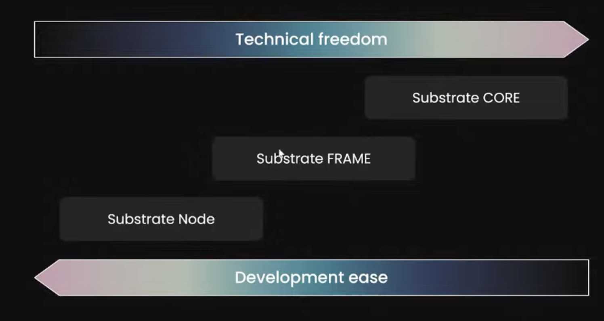

There are different FRAME pallets to choose from in order to add into runtime.

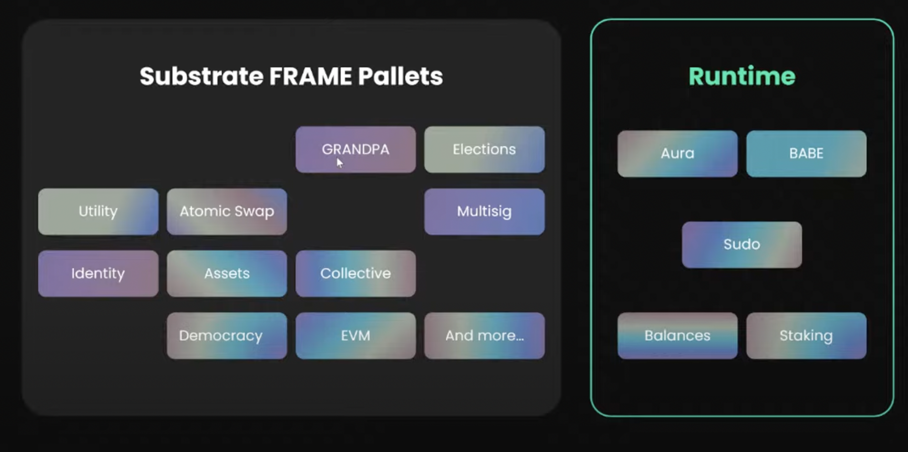

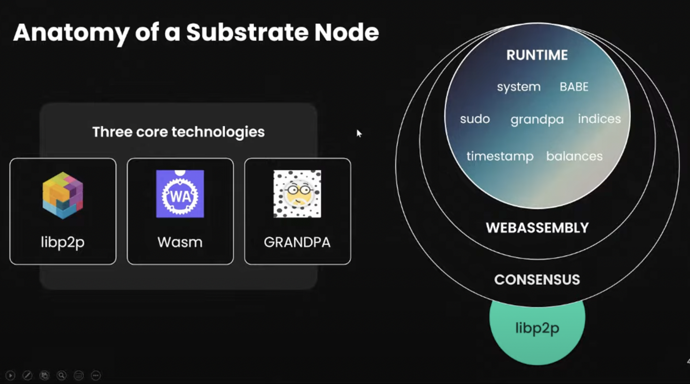

For networking, substrate use `libp2p` protocol (developed by IPFS creators).

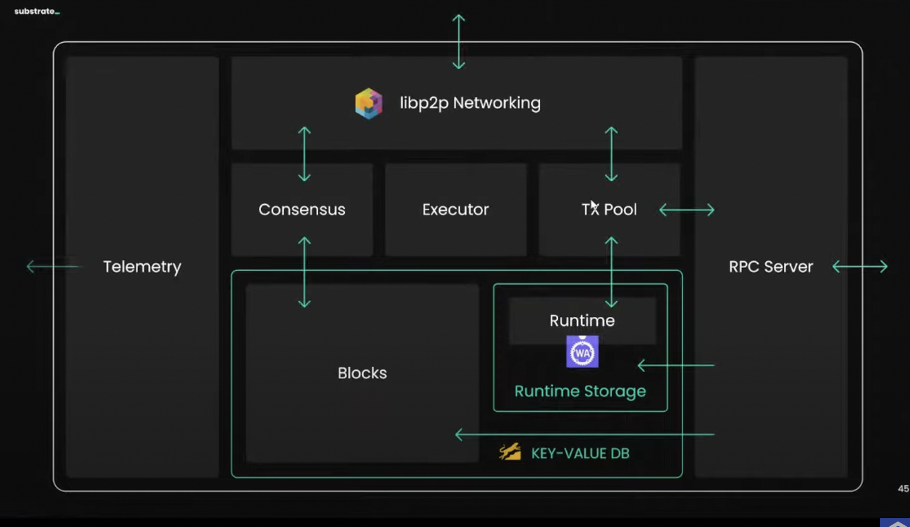

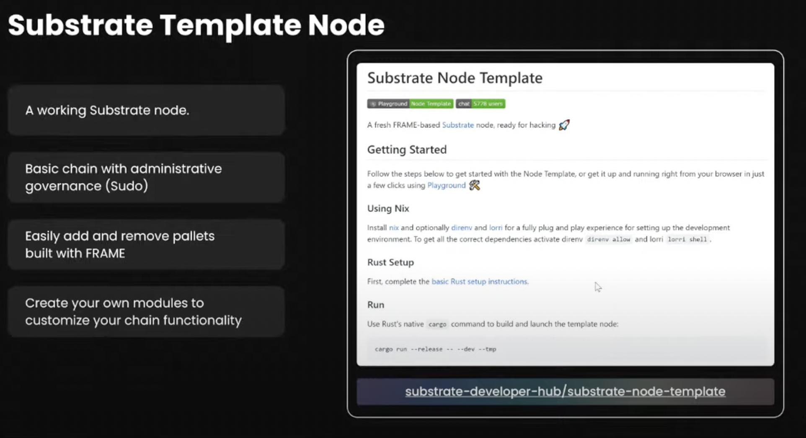

Using this template, we can start a chain locally. [repo](https://github.com/substrate-developer-hub/substrate-node-template).

Using the front-end template, we can view the information on a website. [repo](https://github.com/substrate-developer-hub/substrate-front-end-template).

Substrate pallets:
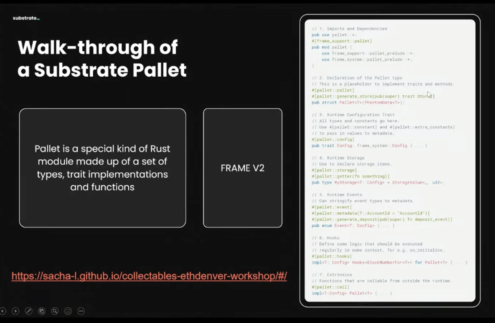

The development workflow to pallet:
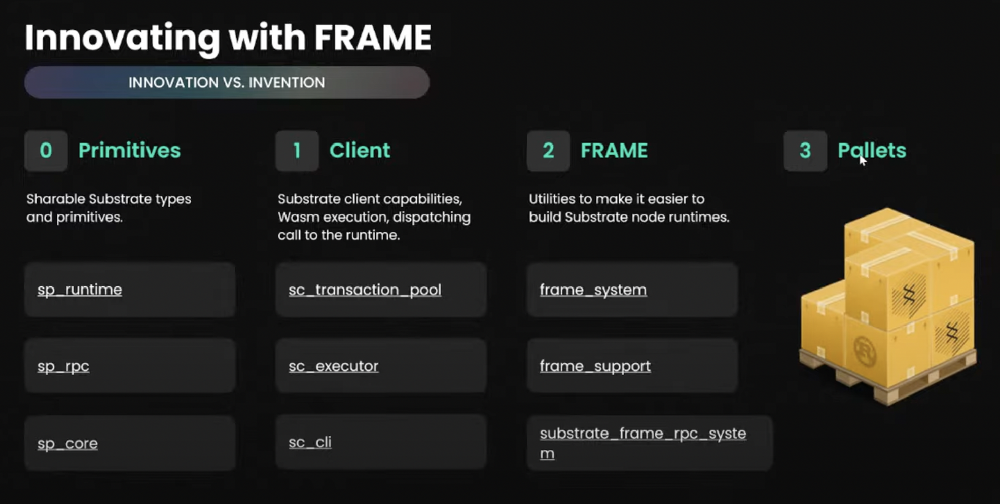

where, sp: substrate pallet, sc: substrate client

## Auction

In Polkadot, in order to secure a slot, a project/parachain has to bid in the auction. This auction has no end time. The winning is completely based on the highest amounts in terms of ranking.

This auction is similar to Candle auction in 16th century.

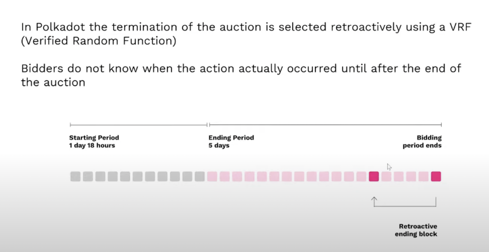

There is also a feature of crowdloan where anyone holding DOT can lend to project/parachain. And after the auction period is over, the DOTs are returned back to the owners permissionlessly.

## Tools

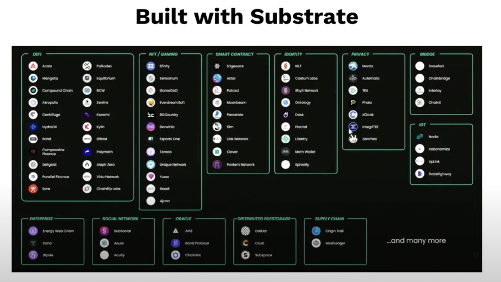

- [Substrate](./substrate/)
  - [playground](https://playground.substrate.dev/): setup w/o local PC.
- [Telemetry](https://telemetry.polkadot.io/): View all the nodes running polkadot.
- Polkadot explorer
  - polkascan: https://explorer.polkascan.io/polkadot
  - https://polkadot.js.org/apps/?rpc=wss%3A%2F%2Fpolkadot.api.onfinality.io%2Fpublic-ws#/explorer
- kusama explorer
  - polkascan: https://explorer.polkascan.io/kusama
  - https://polkadot.js.org/apps/?rpc=wss%3A%2F%2Fkusama.api.onfinality.io%2Fpublic-ws#/explorer

## Polkadot vs Kusama

- All the new features are deployed on Kusama 1st & then it gets deployed on Polkadot.
- There are plans to brige both these relay chains

## Interoperability

There are message protocols which are used for communicating b/w chains. E.g. XCM, XCMP

- XCM: Cross Consensus Message format
- XCMP: Cross Chain Messaging Protocol

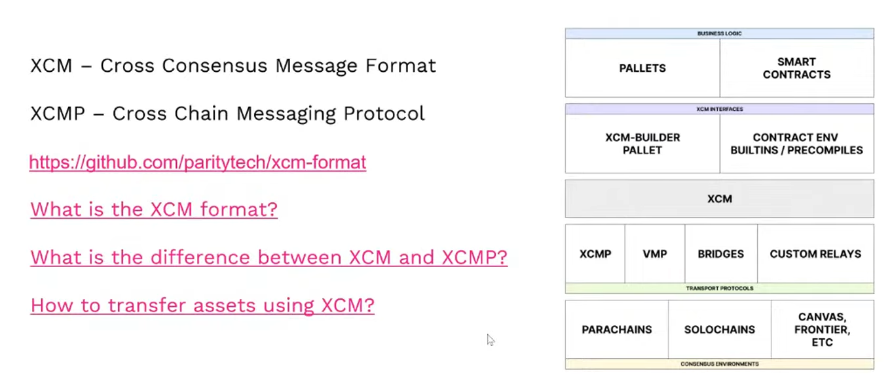

## Network architecture

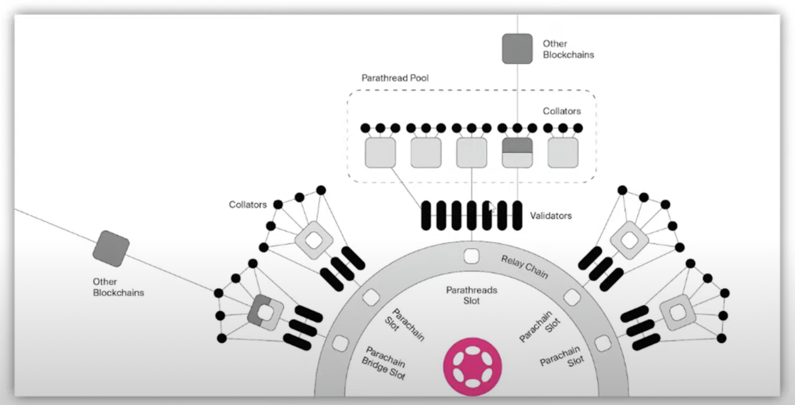

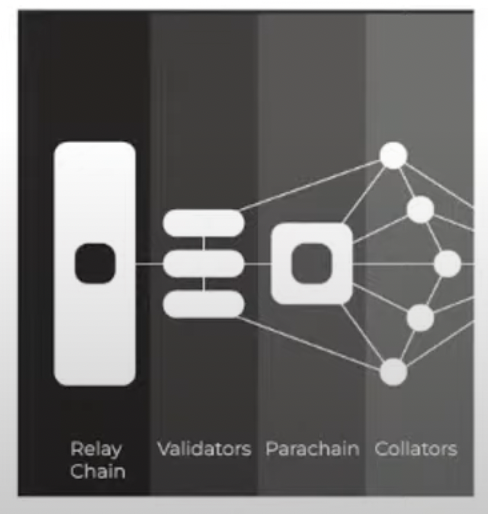

The **collators** give the **proof** (parachains' block when reached finality i.e. 'proof of validity') to the **validators** who then add to the **relay chain**.

Each parachain has 2 options of adding blocks into the relay chain:

- slot (`stake DOT` & secure position)
- parathread pool (`pay-as-you-go` model)

## State transition

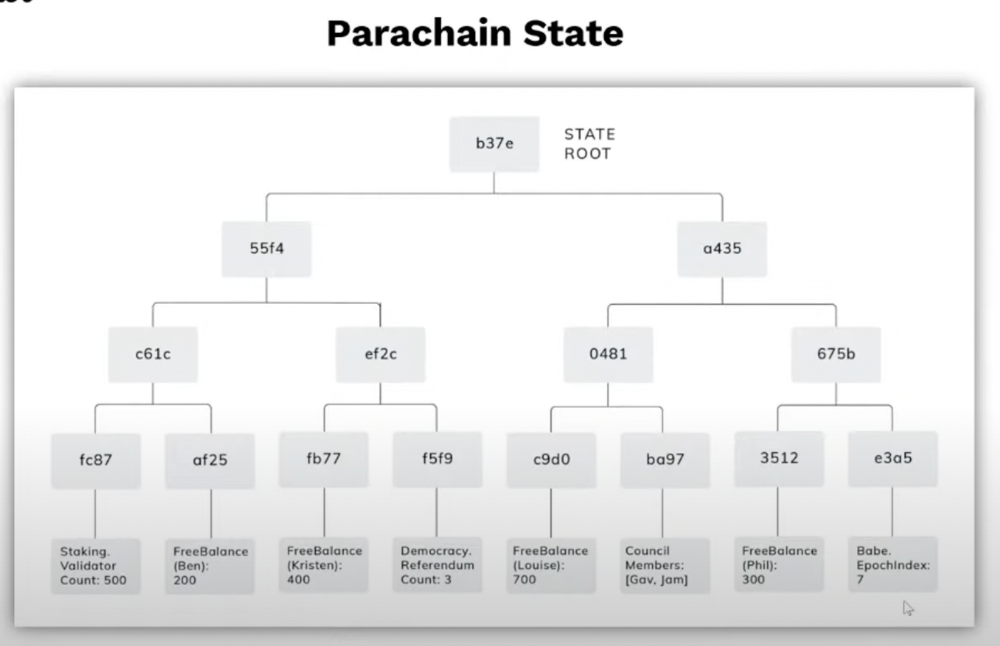

It stays in merkle tree.

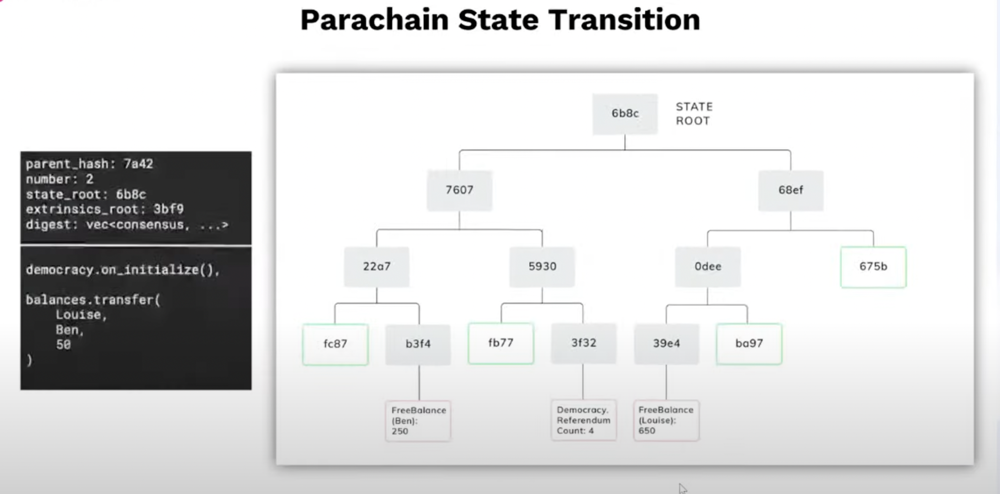

Here, only the nodes which have been changed in terms of data, those gets added in hash. The figure above shows the transition state.

## Proof of Validity

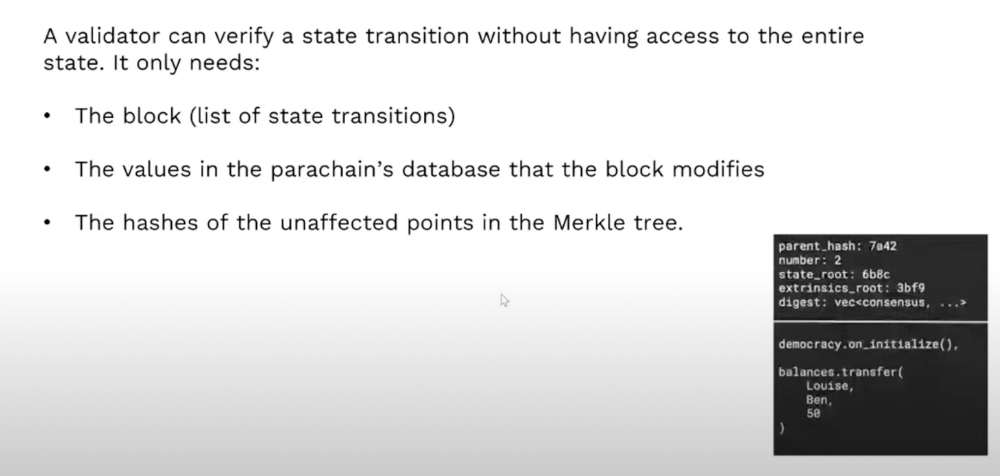

## Validation process

A receipt is used to put into the blocks of relay chain

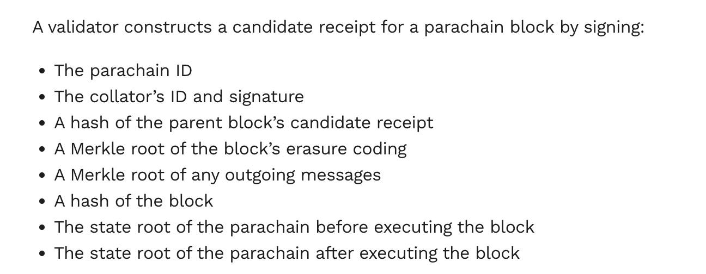

## Upgrades

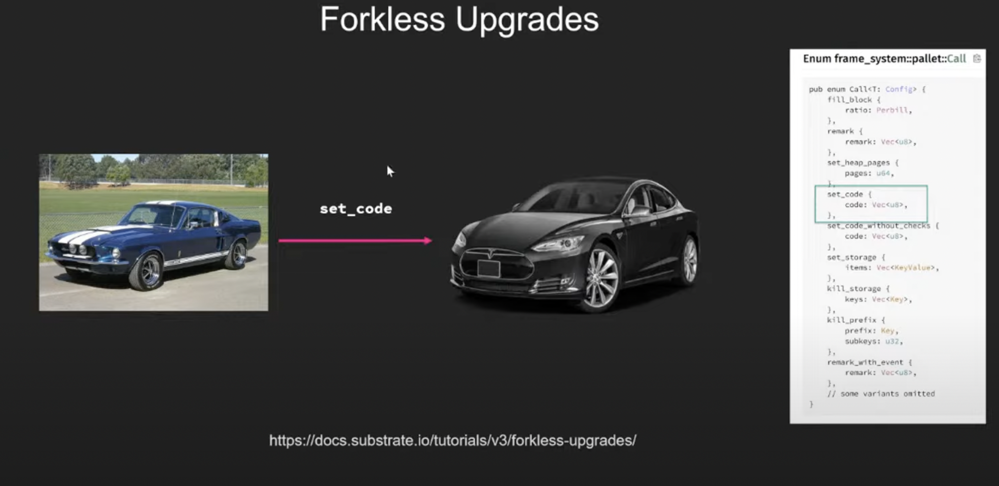

There is a `set_code` function which allows to upgrade the network.

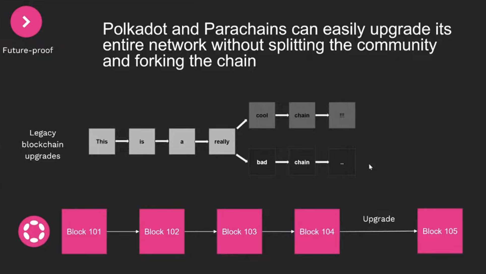

It shows comparo b/w legacy & polkadot blockchains.

## References

### Blogs

- [HOW TO BUILD PARACHAIN ON POLKADOT](https://www.leewayhertz.com/build-parachain-on-polkadot/)
- [Polkadot Messaging Scheme (XCMP)](https://deeprnd.medium.com/polkadot-messaging-scheme-xcmp-afcdb9b52616)

### Videos

- [Gavin Wood: Explaining the Polkadot Launch Process](https://www.youtube.com/watch?v=TpcCeo-ZkDY)
- [Chainlink | Introduction to Polkadot, Parachains, and Substrate](https://www.youtube.com/watch?v=gT-9r1bcVHY)
- [The Path of a Parachain Block on Polkadot and Kusama Network](https://www.youtube.com/watch?v=m0vxqWwFfDs)
